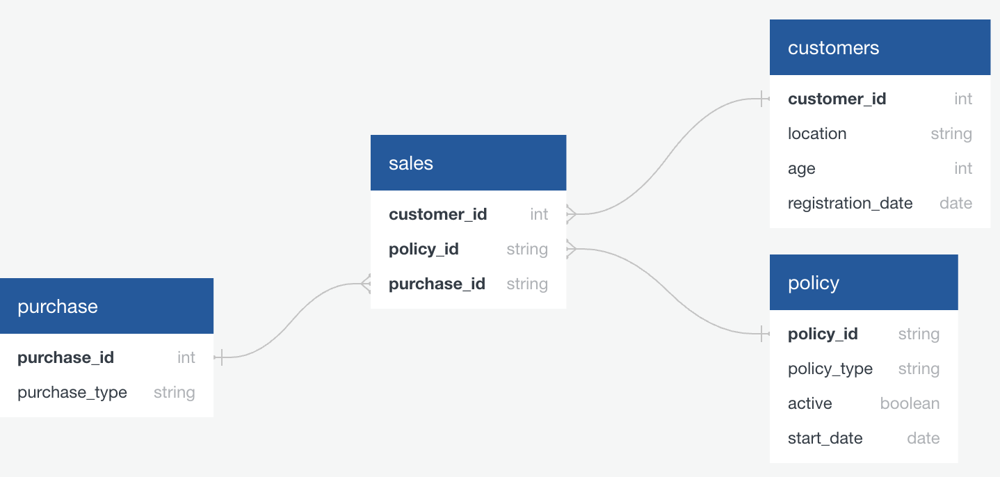

# 🧾 Insurance Upgrades – SQL Data Cleaning & Reporting Project

This project simulates a practical data engineering and analytics task for a fictional U.S.-based travel company, **Travel Assured**, which offers services like insurance, flights, and hotel bookings.

## 🧠 Problem Overview

The sales team plans to launch a **promotion targeting existing customers**. They need clean and accurate data to:

1. Target eligible customers.
2. Track upgrade purchases.
3. Monitor active policyholders by type.

---

## 📦 Database Schema

The schema includes the following tables:
- **customers**: Customer info (age, location, registration date)
- **sales**: Links customers, policies, and purchases
- **policy**: Policy details (type, status, start date)
- **purchase**: Purchase metadata (type, e.g., 'Upgrade')

